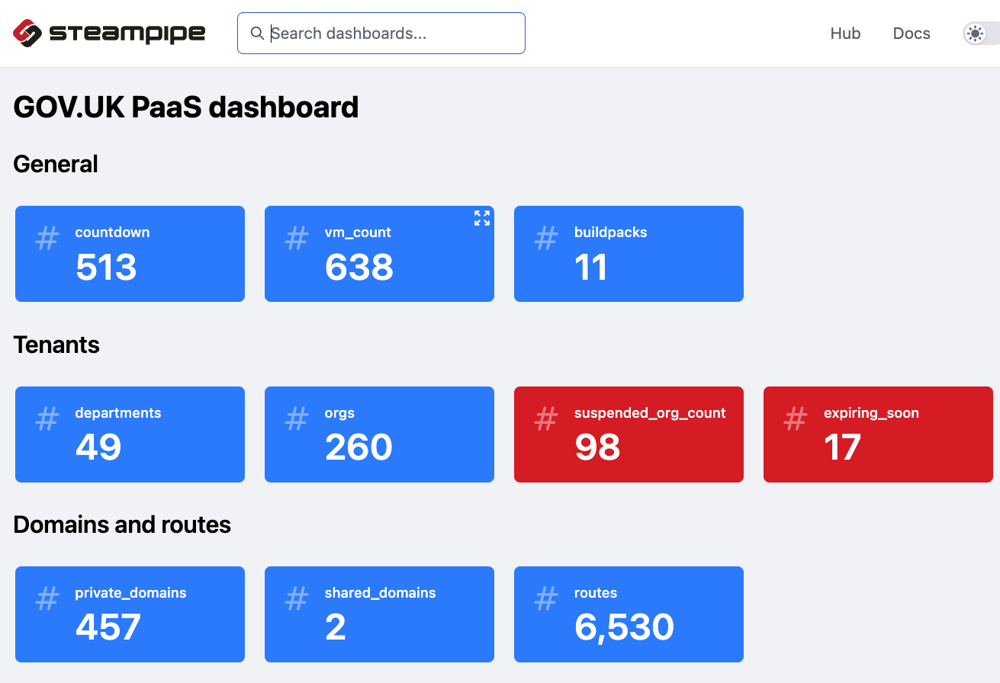

# GOV.UK PaaS dashboard

A dashboard to monitor the [GOV.UK PaaS](https://cloud.service.gov.uk) platform.

Uses [Steampipe](https://steampipe.io/) to access all the component parts from the underlying infrastructure in AWS and Aiven through to the Cloud Foundey core of the paas, its code base and supporting tools.
 

see [kanban](https://github.com/pauldougan/paas-steampipe-dashboard/projects/1) board for current plan.

Originally a [:fire: firebreak](https://insidegovuk.blog.gov.uk/2018/05/03/firebreaks-on-gov-uk/) experiment.

# Overview



[Steampipe](https://steampipe.io) provides a SQL layer on top of a [wide range of cloud platform services](https://hub.steampipe.io/plugins) that have apis using a postgresql [foreign data wrapper](https://github.com/turbot/steampipe-postgres-fdw). 

This dashboard uses [steampipe.io](https://steampipe.io) to build a set of dashboards over [GOV.UK PaaS](https://cloud.service.gov.uk) and its infrastructure.

It uses the [Cloud Foundry CLI](https://github.com/cloudfoundry/cli) to access the Cloud Foundry API and list resources such as orgs, apps,services, 
the data is saved locally as csv files and accessed from a local steampipe dashboard running at http://localhost:9194

It uses the plugins configured in [dashboards/mod.sp](dashboards/mod.sp)

The [dashboards](/dashboards) pull data from the underlying csv files using postgres SQL and render the results as a dashboard.

# How it works

## 1. logs into Cloud Foundry instances using the CF CLI 

`cf login --sso`

## 2. extracts data in csv format from the Cloud Foundry API 


`cf curl /v3/foobar | in2csv -f json -k resources` converting JSON into CSV using csvkit's [in2csv](https://csvkit.readthedocs.io/en/latest/scripts/in2csv.html)

## 3. Logs into AWS using GDS CLI using MFA and assumes a role with read only permissions 

`gds aws paas-prod-ro`

## 4. extracts AWS data into CSV using steampipe aws plugin

`steampipe query query.sql -- output csv | gsed -E '/^$/d'`

Delete blank lines because steampipe adds a blank line to the end of the file.

## 5. launches steampipe dashboard

Render results locally accessing data from plugins, running SQL queries against the normalised data using postgresql

Read about the [data model](docs/datamodel.md)

# Prerequisites

Assumes you are on a mac with [homebrew](https://brew.sh) installed with `/bin/bash -c "$(curl -fsSL https://raw.githubusercontent.com/Homebrew/install/HEAD/install.sh)"`

```
# homebrew packages
brew install cf-cli@8      # Cloud Foundry CLI
brew install gawk          # GNU awk
brew install gh            # GitHub CLI
brew install glow          # Glow CLI for markdown 
brew install gnu-sed       # GNU sed
brew install jq            # JSON wrangling tool
brew install steampipe     # make cloud apis queryble via SQL 
brew install yq            # YAML tools

# python tools
pip3 install csvkit        # csv wrangling tools
pip3 install visidata      # data wrangling swiss army penknife tool
```
that you are on the VPN 

you have a [GOV.UK PaaS account](https://cloud.service.gov.uk) with [global auditor](https://docs.cloudfoundry.org/concepts/roles.html#permissions) permissions and yiu are logged in using `make login`

you are a gds-user with permisssions to assume role into all the paas infrastructure AWS accounts

you have the aiven CLI configured with an access token to list services  


# Usage

## 1. install dependencies

git clone https://pgithub.com/pauldougan/paas-steampipe-dashboard

`cd paas-steampipe-dashboard`

`make dependencies` to install all the necessary packages                       

## 2. configure plugins

see [config](config) for examples

`vim ~/.steampipe/config`

## 3. extract data

you need creds to access the AWS accounts

`gds aws paas-paas-ro -- make data`

this logs into to AWS and Cloud Foundry, extracts data locally in csv format 

## 4. run dashboard 
  
`make dashboard` to run the dashboard with the current data and launch dashboard at http://localhost:9194

does not need Cloud Foundry or AWS creds because the dashboard uses local data

## 5. work with data

`make edit-csvs`


